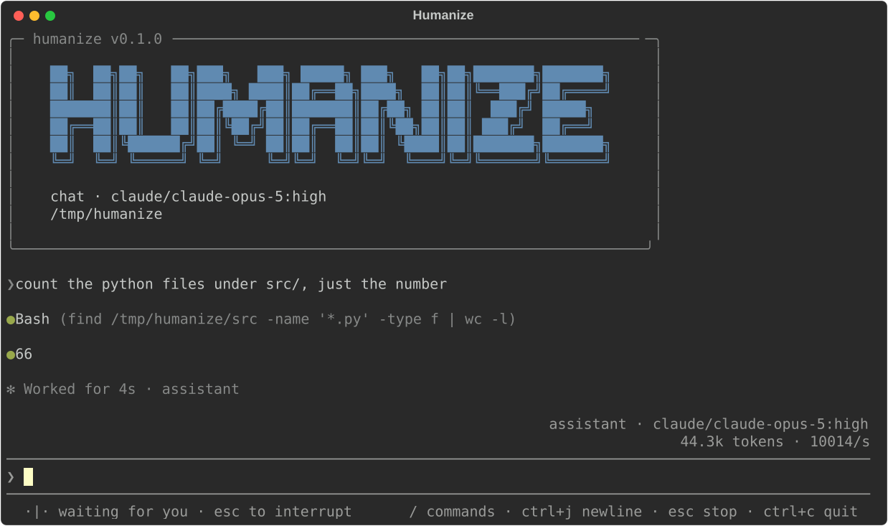

# humanize


[](https://github.com/RichardLitt/standard-readme)
[](LICENSE)

Orchestrate, execute, and observe agent flows

## Table of Contents

- [Install](#install)
- [Usage](#usage)
- [Documentation](#documentation)
- [Security](#security)
- [Maintainers](#maintainers)
- [Contributing](#contributing)
- [License](#license)

## Install

```sh
pip install git+https://github.com/humanfia/humanize.git
```

From source, with [uv](https://docs.astral.sh/uv/):

```sh
git clone https://github.com/humanfia/humanize.git
cd humanize
uv sync
```

### Dependencies

Python ≥ 3.12, and the coding agent CLIs you intend to drive (`claude`, `codex`, `kimi`) on your
PATH. [Isolation](docs/isolation.md) and [remote execution](docs/remote-execution.md) ask for more.

## Usage

To use the TUI:

```sh
hmz
```



If you don't want to use the TUI, you can run a [flow](docs/flows.md) over the agents you name, one `-a` apiece:

```sh
hmz exec -f flame_chase \
    -a claude-code/claude-opus-4-8:high -a codex/gpt-5.6-sol:high "fix the build"
```

An agent is a CLI, a model and an effort, written either way round:

```sh
hmz exec -f ralph_loop -a cli=claude,model=claude-opus-4-8,effort=high "fix the build"
```

`-f` takes the name of a flow humanize came with, one of your own under `.humanize/flows` here or
in your home directory, or the path to a file anywhere else.

Every run is one cycle, written down under `~/.humanize/cycles` as it happens: the flow, the
agents, and every session they opened. Collect what it left behind, and open the file in
[ui.perfetto.dev](https://ui.perfetto.dev):

```sh
hmz collect
```

Moor an agent to [another machine](docs/remote-execution.md), so that its work lands there:

```sh
hmz anchor --target ssh://build-box claude
```

## Documentation

- [Flows](docs/flows.md) — writing a flow and running it (`hmz exec`)
- [Agents](docs/agents.md) — sessions, goals, models and efforts, names
- [Isolation](docs/isolation.md) — a container of the agent's own
- [Remote execution](docs/remote-execution.md) — acting on another machine (`hmz anchor`)
- [Tracing](docs/tracing.md) — trajectories into a trace (`hmz collect`)

## Security

**An `hmz anchor` port is equivalent to a shell on that machine.** An export bounds which files
a request may name; it does not confine the commands that request can run. Give `--token` a real
secret, and prefer `ssh://` or `docker://`, which need no open port at all.

**humanize runs every agent with permission prompts disabled**, as flowbench does, and there is no
setting that turns them back on — `/afk` governs whether an agent may ask you a question, not
whether it may act. Drive one only in a workspace you are willing to have rewritten — including
under [isolation](docs/isolation.md), which confines the agent to a container of its own but
mounts that workspace into it.

## Maintainers

[@futrime](https://github.com/futrime)

## Contributing

PRs accepted. Ask a question or discuss a substantial change first in
[issues](https://github.com/humanfia/humanize/issues). A change must pass:

```sh
uvx ruff format && uvx ruff check && uv run pytest
uv run pytest --run-agents  # also drives claude, codex and kimi for real
```

If you edit this README, please conform to the
[standard-readme](https://github.com/RichardLitt/standard-readme) specification.

## License

[Apache-2.0](LICENSE) © Zijian Zhang
